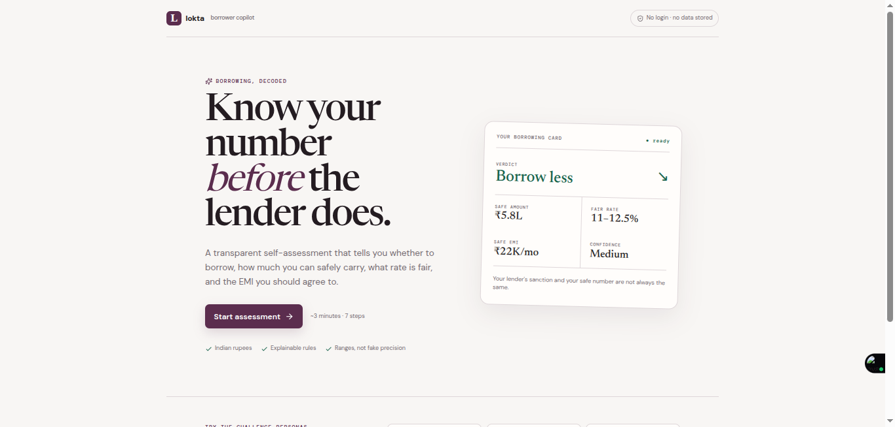
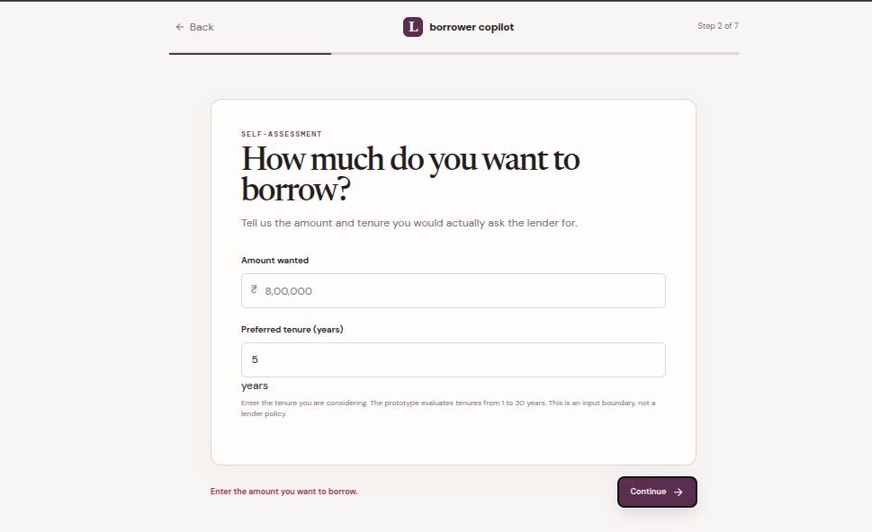
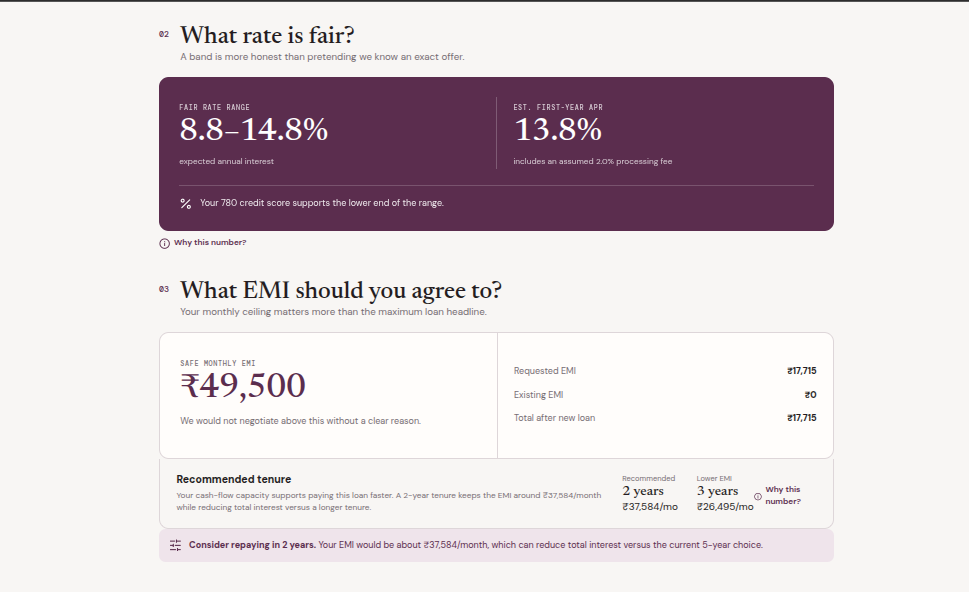
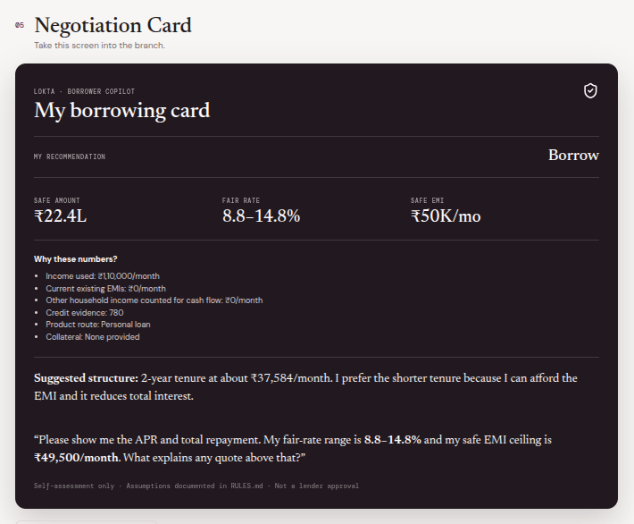
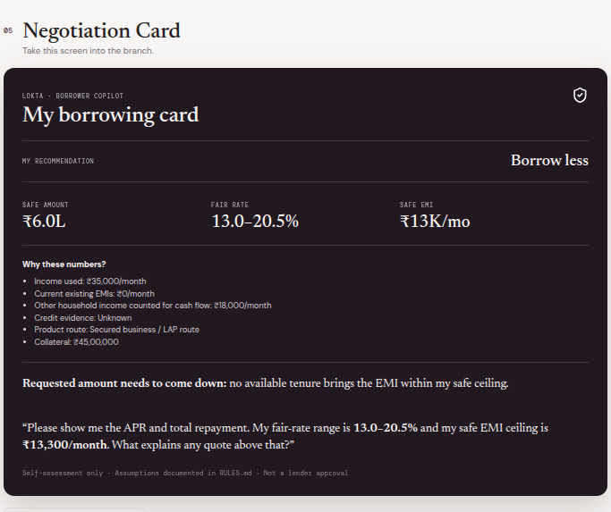
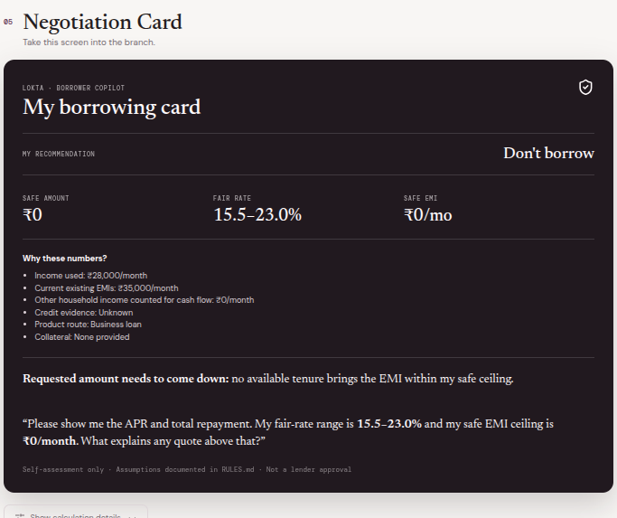

# Borrower Copilot

> A transparent borrowing self-assessment tool for Indian borrowers.

Borrower Copilot helps borrowers answer four practical questions before accepting a loan:

1. **Should I borrow at all?**
2. **How much can I safely borrow?**
3. **What rate is fair for me?**
4. **What EMI should I agree to?**

The app separates what a lender **may potentially sanction** from what the borrower can **comfortably carry**, then turns the result into a practical **Negotiation Card**.

---

## Screenshots

### 1. Borrower onboarding



The starting screen introduces the purpose of the assessment and explains that the output is a negotiation baseline rather than a lender approval.

---

### 2. Adaptive borrower questions



The questionnaire collects only information that can affect the assessment. Additional questions appear based on the borrower's situation, such as self-employment, productive borrowing, existing debt, emergency savings, and income stability.

---

### 3. Borrowing assessment


The result clearly separates:

- Estimated lender-style eligibility
- Borrower-safe amount
- Recommended borrowing decision

The app can recommend **Borrow**, **Borrow less**, or **Don't borrow**.

---

### 4. Rate, EMI and stress test



The assessment provides:

- Fair rate range
- Estimated first-year APR
- Safe monthly EMI ceiling
- Requested EMI
- Existing EMI
- Total EMI after borrowing
- Tenure trade-off
- 20% income-drop stress test

---

### 5. Negotiation Card



The Negotiation Card condenses the assessment into something a borrower can take into a lender conversation.

It includes the recommended amount, fair-rate range, safe EMI, key assumptions, and a suggested negotiation statement.

---

## Core Features

### Borrow / Don't Borrow

The app does not assume that every borrower should take a loan.

It can recommend:

- **Borrow** — requested borrowing is within the borrower-safe range.
- **Borrow less** — the requested amount is above the borrower-safe range.
- **Don't borrow** — financial stress indicators make new borrowing inappropriate.

---

### Lender Amount vs Borrower-Safe Amount

Borrower Copilot intentionally keeps these numbers separate.

**Estimated lender-style eligibility**

An illustrative amount based on lender-style affordability assumptions.

**Borrower-safe amount**

A more conservative amount based on cash-flow affordability and risk adjustments.

> The borrower-safe amount is the number the borrower should negotiate around.

---

### Fair Rate Range

The app provides a **rate band rather than pretending to know an exact lender offer**.

The range considers factors such as:

- Credit score
- Product type
- Recent payment issues
- Income stability
- Credit-card utilisation
- Secured vs unsecured route

The app also estimates first-year APR by incorporating an assumed processing fee.

---

### EMI Affordability

The app calculates a monthly EMI ceiling using affordability rules.

It considers:

- Monthly income
- Existing EMI obligations
- Household expenses
- Borrower type
- FOIR-style limits
- Risk adjustments
- Emergency savings
- Payment history

The requested EMI is compared against the recommended ceiling.

---

### Stress Test

The app tests what happens if income falls by **20%**.

This helps answer:

> "Would I still be able to handle this loan if my income temporarily dropped?"

The result shows the stressed EMI capacity and whether the requested EMI still has headroom.

---

### Product Routing

The borrowing purpose influences the product route.

| Borrowing need | Product route |
|---|---|
| Personal / consumption | Personal loan |
| Business expansion | Business loan |
| Self-employed + collateral | Secured business / LAP route |
| Vehicle | Vehicle loan |
| Home | Home loan |

This prevents the app from treating every borrowing need as the same product.

---

## Adaptive Question Design

The app starts with a small core questionnaire and asks additional questions only when they can affect an output.

Examples:

- Self-employed borrowers → ITR income
- Self-employed borrowers → collateral
- Productive borrowing → expected additional monthly profit
- Existing debt → approximate interest rate
- Risk assessment → emergency savings
- Credit assessment → credit-card utilisation
- Income assessment → income stability
- Salaried borrowers → variable / bonus income share
- Personal financial planning → upcoming major unavoidable expense

Unknown information is **not automatically treated as zero**.

Instead, missing information increases uncertainty or results in a more conservative assumption where appropriate.

---

## Example Personas

The app was designed around three challenge personas.

### Priya

- 29
- Bengaluru
- Salaried software engineer
- ₹1,10,000 monthly net income
- ₹14,000 existing car EMI
- Credit score: 780
- Wants ₹8,00,000 for a wedding


### Ravi

- 42
- Mysuru
- Self-employed kirana store owner
- ₹35,000 monthly ITR income
- Owns an approximately ₹45 lakh unencumbered shop
- Wants ₹15 lakh for business expansion and a delivery vehicle



His collateral can route him toward a secured business / LAP-style product, but collateral does **not** increase the amount he can safely repay from monthly cash flow.

### Anita

- 35
- Hubballi
- Informal delivery rider + tailoring
- ₹26,000–₹30,000 monthly income
- Multiple app loans
- Existing expensive debt
- Recent EMI bounce
- Wants ₹1.5 lakh for an electric scooter



The rules can identify severe financial stress and recommend **Don't borrow** rather than encouraging additional debt.

---

## Transparency & Explainability

Every important number is accompanied by a reason.

The result explains:

- Income used
- Existing EMI
- FOIR assumptions
- Cash-flow affordability
- Credit-score impact
- Risk adjustments
- Product route
- Collateral treatment
- Rate assumptions
- Processing-fee assumption
- Stress-test calculation

The app also provides a **calculation detail** section for users who want to inspect the underlying assumptions.

---

## Negotiation Card

The final Negotiation Card is designed for real-world use.

A borrower can use the generated statement to ask a lender:

> "Please show me the APR and total repayment. My fair-rate range is **X–Y%** and my safe EMI ceiling is **₹X/month**. What explains any quote above that?"

The goal is not to predict lender approval.

The goal is to give the borrower a clearer baseline for negotiation.

---

## Rules

The calculation engine is intentionally rule-based and documented.

See:

**[RULES.md](./RULES.md)**

The rules cover:

- FOIR-style affordability
- Living-cost buffers
- Product rate bands
- Processing fees
- Maximum tenure
- Stress testing
- Credit-score adjustments
- Payment-bounce adjustments
- Credit utilisation
- Emergency savings
- Collateral / LTV treatment
- Productive borrowing sustainability
- Severe financial distress

---

## Tech Stack

- **React**
- **Vite**
- **JavaScript**
- **CSS**
- Rule-based calculation engine

No backend or database is required.

No bureau pull or personal-data storage is used.

---

## Project Structure

```text
borrower-copilot/
├── src/
│   ├── App.jsx
│   ├── rules.js
│   ├── styles.css
│   └── main.jsx
├── public/
│   └── screenshots/
│       ├── onboarding.png
│       ├── questions.png
│       ├── assessment.png
│       ├── analysis.png
│       └── negotiation-card.png
├── RULES.md
├── README.md
├── index.html
├── package.json
├── vite.config.js
└── .gitignore
```

---

## Run Locally

### Requirements

- Node.js 18+
- npm

### Installation

```bash
git clone https://github.com/ganesh1229/borrower-copilot.git
cd borrower-copilot
npm install
```

### Start the development server

```bash
npm run dev
```

Then open the local URL shown by Vite.

---

## Scope & Limitations

Borrower Copilot is a **decision-support prototype**, not a lender underwriting system.

It does not:

- Pull a real credit bureau report
- Guarantee loan approval
- Guarantee an interest rate
- Store personal borrower data
- Replace regulated financial advice
- Represent an offer from any lender

The outputs are intended to help a borrower enter a loan negotiation with clearer affordability and pricing boundaries.

---

## Core Product Principle

> **Don't optimize for the maximum loan a lender might give you. Optimize for the loan you can comfortably live with.**
